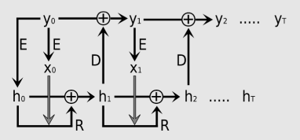

# Residual Neural Networks for the Prediction of Planetary Collision Outcomes

### Description

Official code for the paper "Residual Neural Networks for the Prediction of Planetary Collision Outcomes".

We provide a dataset that consists of 10164 Smooth Particle Hydrodynamics (SPH) simulations of pairwise planetary collisions. The data is available at https://phaidra.univie.ac.at/o:1206181.

  
We propose a weight-tied residual neural network for prediction of post-collision states. Our architecture incorporates an inductive bias to treat temporal dynamics consistently by evolving system states in an autoregressive manner.

### Usage

1) install used packages
2) set parameters in config.yaml. The "mode" variable defines the general usage. 
3) run script with `python3 main.py`. The CUDA device can be specified by the environment variable `CUDA_VISIBLE_DEVICES`.

Pre-trained models may be used within N-body frameworks. Take care to apply pre -and postprocessing as in this source code.

For development we used Ubuntu 18.04 with anaconda (pytorch version 1.9 and CUDA version 10.2).

In case you desire to generate data on your own, please visit https://github.com/christophmschaefer/miluphcuda. We provide our used parameter file in `SPH/miluphcuda/parameter.h`.

In case of questions please contact <winter@ml.jku.at> (Philip Winter).
